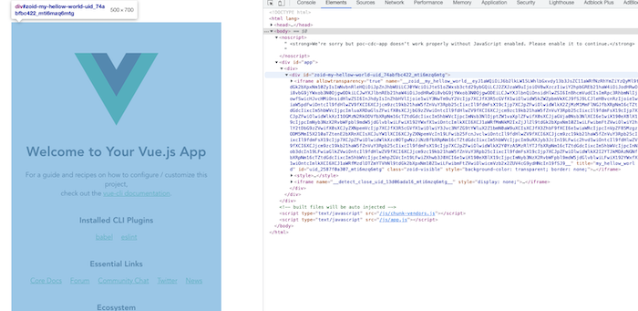

# ps-poc-cdc

This is the simplest POC to use cross domain component in VueJS

## Project setup
```
yarn install
```

### Compiles and hot-reloads for development

```
yarn serve
```

This will open: http://localhost:8081 automatically. If you inspect the page you should see tha te contact comes from a cross domain component which use an iframe.


